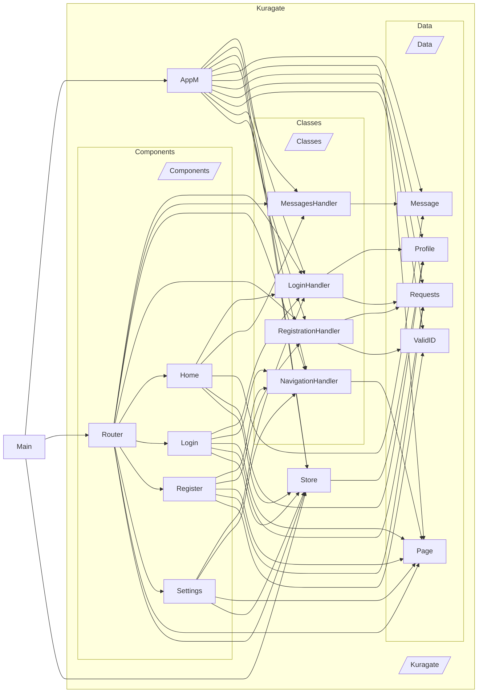

```mermaid
flowchart LR
subgraph Kuragate_subgraph [Kuragate]
Kuragate[/Kuragate/]
Kuragate.AppM[AppM]
Kuragate.Store[Store]
subgraph Kuragate.Classes_subgraph [Classes]
Kuragate.Classes[/Classes/]
Kuragate.Classes.LoginHandler[LoginHandler]
Kuragate.Classes.MessagesHandler[MessagesHandler]
Kuragate.Classes.NavigationHandler[NavigationHandler]
Kuragate.Classes.RegistrationHandler[RegistrationHandler]
end
subgraph Kuragate.Components_subgraph [Components]
Kuragate.Components[/Components/]
Kuragate.Components.Home[Home]
Kuragate.Components.Login[Login]
Kuragate.Components.Register[Register]
Kuragate.Components.Router[Router]
Kuragate.Components.Settings[Settings]
end
subgraph Kuragate.Data_subgraph [Data]
Kuragate.Data[/Data/]
Kuragate.Data.Message[Message]
Kuragate.Data.Page[Page]
Kuragate.Data.Profile[Profile]
Kuragate.Data.Requests[Requests]
Kuragate.Data.ValidID[ValidID]
end
end
Main[Main]
Kuragate.AppM --> Kuragate.Classes.LoginHandler
Kuragate.AppM --> Kuragate.Classes.MessagesHandler
Kuragate.AppM --> Kuragate.Classes.NavigationHandler
Kuragate.AppM --> Kuragate.Classes.RegistrationHandler
Kuragate.AppM --> Kuragate.Data.Message
Kuragate.AppM --> Kuragate.Data.Page
Kuragate.AppM --> Kuragate.Data.Profile
Kuragate.AppM --> Kuragate.Data.Requests
Kuragate.AppM --> Kuragate.Data.ValidID
Kuragate.AppM --> Kuragate.Store
Kuragate.AppM --> Kuragate.Store
Kuragate.Store --> Kuragate.Data.Profile
Kuragate.Classes.LoginHandler --> Kuragate.Data.Profile
Kuragate.Classes.LoginHandler --> Kuragate.Data.Requests
Kuragate.Classes.MessagesHandler --> Kuragate.Data.Message
Kuragate.Classes.NavigationHandler --> Kuragate.Data.Page
Kuragate.Classes.RegistrationHandler --> Kuragate.Data.Requests
Kuragate.Classes.RegistrationHandler --> Kuragate.Data.ValidID
Kuragate.Components.Home --> Kuragate.Classes.LoginHandler
Kuragate.Components.Home --> Kuragate.Classes.MessagesHandler
Kuragate.Components.Home --> Kuragate.Data.Message
Kuragate.Components.Home --> Kuragate.Data.Profile
Kuragate.Components.Home --> Kuragate.Store
Kuragate.Components.Login --> Kuragate.Classes.LoginHandler
Kuragate.Components.Login --> Kuragate.Classes.NavigationHandler
Kuragate.Components.Login --> Kuragate.Data.Page
Kuragate.Components.Login --> Kuragate.Data.Requests
Kuragate.Components.Login --> Kuragate.Store
Kuragate.Components.Register --> Kuragate.Classes.NavigationHandler
Kuragate.Components.Register --> Kuragate.Classes.RegistrationHandler
Kuragate.Components.Register --> Kuragate.Data.Page
Kuragate.Components.Register --> Kuragate.Data.Requests
Kuragate.Components.Register --> Kuragate.Data.ValidID
Kuragate.Components.Router --> Kuragate.Classes.LoginHandler
Kuragate.Components.Router --> Kuragate.Classes.MessagesHandler
Kuragate.Components.Router --> Kuragate.Classes.NavigationHandler
Kuragate.Components.Router --> Kuragate.Classes.RegistrationHandler
Kuragate.Components.Router --> Kuragate.Components.Home
Kuragate.Components.Router --> Kuragate.Components.Login
Kuragate.Components.Router --> Kuragate.Components.Register
Kuragate.Components.Router --> Kuragate.Components.Settings
Kuragate.Components.Router --> Kuragate.Data.Page
Kuragate.Components.Router --> Kuragate.Store
Kuragate.Components.Settings --> Kuragate.Classes.LoginHandler
Kuragate.Components.Settings --> Kuragate.Classes.NavigationHandler
Kuragate.Components.Settings --> Kuragate.Data.Page
Kuragate.Components.Settings --> Kuragate.Store
Main --> Kuragate.AppM
Main --> Kuragate.Components.Router
Main --> Kuragate.Store
```