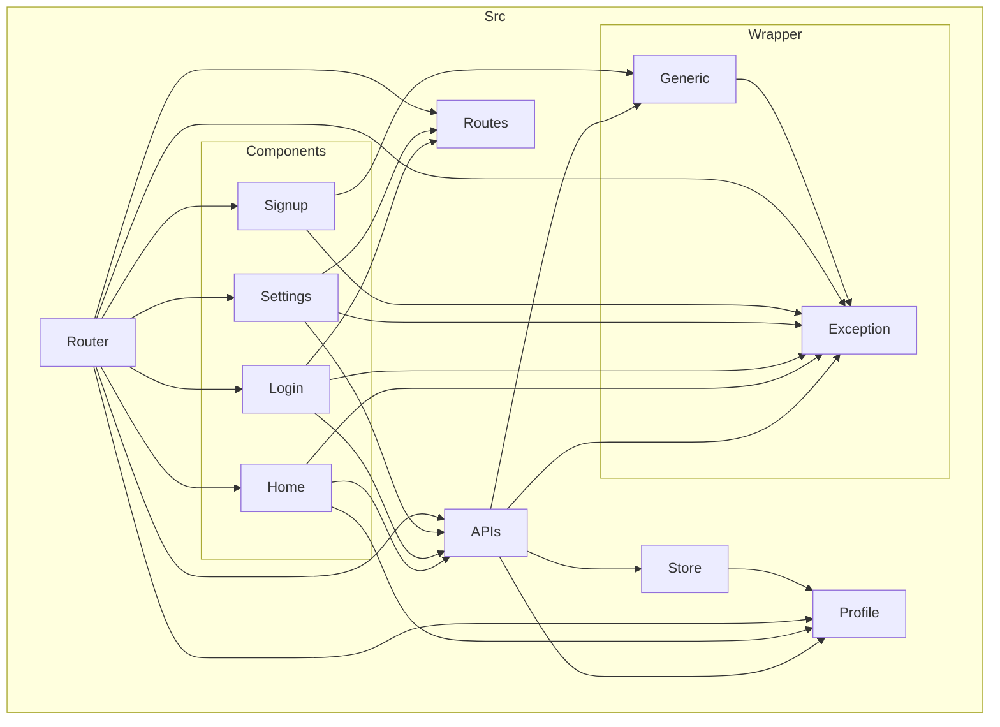

```mermaid
flowchart TB
subgraph Src[Src]
Src.APIs[APIs]
subgraph Src.Components[Components]
Src.Components.Home[Home]
Src.Components.Login[Login]
Src.Components.Settings[Settings]
Src.Components.Signup[Signup]
end
Src.Profile[Profile]
Src.Router[Router]
Src.Routes[Routes]
Src.Store[Store]
subgraph Src.Wrapper[Wrapper]
Src.Wrapper.Exception[Exception]
Src.Wrapper.Generic[Generic]
end
end
Src.APIs --> Src.Profile
Src.APIs --> Src.Store
Src.APIs --> Src.Wrapper.Exception
Src.APIs --> Src.Wrapper.Generic
Src.Components.Home --> Src.APIs
Src.Components.Home --> Src.Profile
Src.Components.Home --> Src.Wrapper.Exception
Src.Components.Login --> Src.APIs
Src.Components.Login --> Src.Routes
Src.Components.Login --> Src.Wrapper.Exception
Src.Components.Settings --> Src.APIs
Src.Components.Settings --> Src.Routes
Src.Components.Settings --> Src.Wrapper.Exception
Src.Components.Signup --> Src.Wrapper.Exception
Src.Components.Signup --> Src.Wrapper.Generic
Src.Router --> Src.APIs
Src.Router --> Src.Components.Home
Src.Router --> Src.Components.Login
Src.Router --> Src.Components.Settings
Src.Router --> Src.Components.Signup
Src.Router --> Src.Profile
Src.Router --> Src.Routes
Src.Router --> Src.Wrapper.Exception
Src.Store --> Src.Profile
Src.Wrapper.Generic --> Src.Wrapper.Exception
```